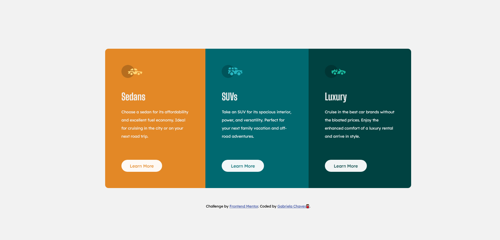

# Frontend Mentor - 3-column preview card component solution

This is a solution to the [3-column preview card component challenge on Frontend Mentor](https://www.frontendmentor.io/challenges/3column-preview-card-component-pH92eAR2-). Frontend Mentor challenges help you improve your coding skills by building realistic projects. 

## Table of contents

- [Overview](#overview)
  - [The challenge](#the-challenge)
  - [Screenshot](#screenshot)
  - [Links](#links)
- [My process](#my-process)
  - [Built with](#built-with)
  - [What I learned](#what-i-learned)
  - [Continued development](#continued-development)
  - [Useful resources](#useful-resources)
- [Author](#author)
- [Acknowledgments](#acknowledgments)

## Overview

### The challenge

Users should be able to:

- View the optimal layout depending on their device's screen size
- See hover states for interactive elements

### Screenshot

### Links

- Solution URL: (https://www.frontendmentor.io/solutions/html-css-NX0wLUNAy)
- Live Site URL:(https://chavesbie.github.io/3-column-preview-card-component/)

## My process

I started with an unordered list and center them int he page. Each list has the icons, the paragraph, the text and the buttom.
I found it easier this way, because when I edit them in CSS, was used only three classes.
As you can see in the file, It's not fill with lots of divs to edit.

### Built with

- HTML5 
- CSS3 

### What I learned

The fact that I could edited a lot of content at once was somethig that i learned in a online class and udeing it was great. 
I also had problems with the display of the contents, but I fixed it to fill the page.

### Useful resources

- [w3schools](https://www.w3schools.com/css/default.asp) - This helped me to find the right names. I really liked this page and will use it going forward.

## Author

- LinkedIn - [Gabriela Chaves](https://www.linkedin.com/in/gabrielachaves95/)
- Frontend Mentor - [@chavesbie](https://www.frontendmentor.io/profile/chavesbie/solutions)

